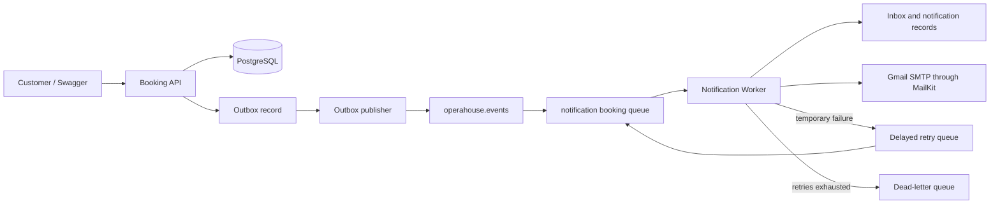

# OperaHouse

OperaHouse is a .NET 10 learning and portfolio project for building a production-oriented opera and concert ticketing platform with RabbitMQ.

The project deliberately uses bare `RabbitMQ.Client` instead of MassTransit so exchanges, queues, bindings, routing keys, acknowledgements, retries, dead-lettering, publisher confirms, inbox, and outbox behaviour remain visible in the code.

## Current capabilities

- Browse available performances.
- Create a pending guest booking using an email address.
- Retrieve a booking by ID.
- Save booking data in PostgreSQL through EF Core.
- Save an outbox message in the same transaction as a booking.
- Publish `booking.created` through RabbitMQ with publisher confirms.
- Consume messages using manual ACK and NACK.
- Retry transient processing failures through a delayed retry queue.
- Move exhausted messages to a dead-letter queue.
- Deduplicate consumed events using an inbox table.
- Persist notification processing status.
- Send real email through MailKit and Gmail SMTP.
- Propagate message and correlation identifiers through the flow.
- Check PostgreSQL and RabbitMQ health.

## Current message flow



## Solution structure

```text
src/
├── OperaHouse.Booking.Api
├── OperaHouse.Booking.Application
├── OperaHouse.Booking.Domain
├── OperaHouse.Booking.Infrastructure
├── OperaHouse.Notification.Worker
├── OperaHouse.Notification.Application
├── OperaHouse.Notification.Domain
├── OperaHouse.Notification.Infrastructure
├── OperaHouse.Contracts
└── OperaHouse.Messaging
```

### Booking

- **API** contains HTTP controllers, request models, Swagger, health endpoint registration, and dependency injection composition.
- **Application** coordinates booking and performance use cases.
- **Domain** contains business entities and states.
- **Infrastructure** contains EF Core persistence, repositories, migrations, and outbox publishing.

### Notification

- **Worker** owns the RabbitMQ consumer and process lifetime.
- **Application** coordinates inbox checks, notification persistence, and email delivery.
- **Domain** contains inbox and notification records and statuses.
- **Infrastructure** contains EF Core persistence and the MailKit SMTP adapter.

### Shared projects

- **Contracts** contains integration events shared between publishers and consumers.
- **Messaging** contains the understandable RabbitMQ publisher, options, and health check.

## Technology

- .NET 10
- ASP.NET Core Web API
- .NET Worker Service
- Entity Framework Core
- FluentValidation
- AutoMapper
- PostgreSQL 17
- RabbitMQ 4 with Management UI
- `RabbitMQ.Client` 7.x
- MailKit and Gmail SMTP
- Docker Compose
- Swagger UI

## Prerequisites

- .NET 10 SDK
- Docker Desktop
- An IDE such as JetBrains Rider or Visual Studio
- A Gmail account with two-step verification and an App Password for local email testing

## Local setup

### 1. Start infrastructure

From the repository root:

```powershell
docker compose up -d
```

PostgreSQL is exposed on host port `54320`. RabbitMQ uses `5672`, and its Management UI is available at [http://localhost:15672](http://localhost:15672).

Local RabbitMQ credentials are defined in `docker-compose.yml`.

Check the containers:

```powershell
docker compose ps
```

### 2. Restore and build

```powershell
dotnet restore
dotnet build
```

### 3. Apply EF Core migrations

Booking database:

```powershell
dotnet ef database update `
  --project src/OperaHouse.Booking.Infrastructure `
  --startup-project src/OperaHouse.Booking.Api
```

Notification database:

```powershell
dotnet ef database update `
  --project src/OperaHouse.Notification.Infrastructure `
  --startup-project src/OperaHouse.Notification.Worker
```

Both contexts currently use the same local PostgreSQL database while retaining separate EF Core models and responsibilities.

### 4. Configure Gmail locally

Never put the Gmail App Password in `appsettings.json` or commit it.

Store the settings in the Notification Worker’s .NET User Secrets:

```powershell
dotnet user-secrets set "Email:Host" "smtp.gmail.com" --project src/OperaHouse.Notification.Worker
dotnet user-secrets set "Email:Port" "587" --project src/OperaHouse.Notification.Worker
dotnet user-secrets set "Email:UserName" "your-address@gmail.com" --project src/OperaHouse.Notification.Worker
dotnet user-secrets set "Email:Password" "YOUR_GOOGLE_APP_PASSWORD" --project src/OperaHouse.Notification.Worker
dotnet user-secrets set "Email:FromAddress" "your-address@gmail.com" --project src/OperaHouse.Notification.Worker
dotnet user-secrets set "Email:FromName" "OperaHouse" --project src/OperaHouse.Notification.Worker
dotnet user-secrets set "Email:UseStartTls" "true" --project src/OperaHouse.Notification.Worker
```

Use a Google App Password, not the normal Gmail account password.

### 5. Run the applications

Run the Booking API:

```powershell
dotnet run --project src/OperaHouse.Booking.Api
```

Run the Notification Worker in another terminal:

```powershell
dotnet run --project src/OperaHouse.Notification.Worker
```

Open the Booking API URL shown in its console and append `/swagger` to use Swagger UI.

## API endpoints

| Method | Route | Purpose |
| --- | --- | --- |
| `GET` | `/performances` | List customer-visible performances |
| `POST` | `/bookings` | Create a pending guest booking |
| `GET` | `/bookings/{id}` | Retrieve a booking |
| `GET` | `/health` | Check Booking API dependencies |

## RabbitMQ topology

| Purpose | Name |
| --- | --- |
| Events exchange | `operahouse.events` |
| Booking routing key | `booking.created` |
| Notification queue | `notification-booking-created.queue` |
| Retry exchange | `operahouse.retry` |
| Retry queue | `notification-booking-created.retry.queue` |
| Dead-letter exchange | `operahouse.dead-letter` |
| Dead-letter queue | `notification-booking-created.dead-letter.queue` |

All important exchanges and queues are durable. Published business messages are persistent, and the consumer uses manual acknowledgements.

## Documentation

- [Development roadmap](docs/ROADMAP.md)
- [Messaging debugging runbook](docs/messaging-debugging.md)
- [Project collaboration rules](PROJECT_RULES.md)
- Additional design and use-case documents are available in the `docs` directory.

See the [roadmap](docs/ROADMAP.md) for payments, ticketing, invoicing, observability, testing, security, and Azure deployment plans.

## Important production note

Gmail SMTP is suitable for local development and portfolio demonstrations, but it is not the intended production email platform. The production Azure deployment is planned to use Azure Communication Services Email while retaining `IEmailSender` so application logic does not depend on a specific provider.

AutoMapper 16 is dual-licensed. Configure `AUTOMAPPER_LICENSE_KEY` in commercial production environments when required; never commit the license key to the repository.
